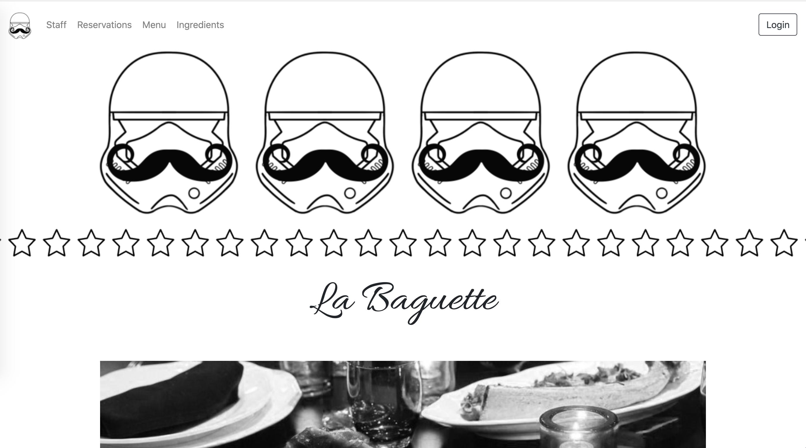
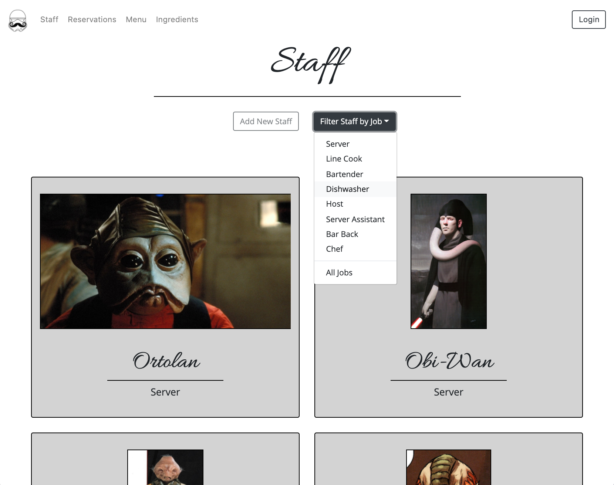
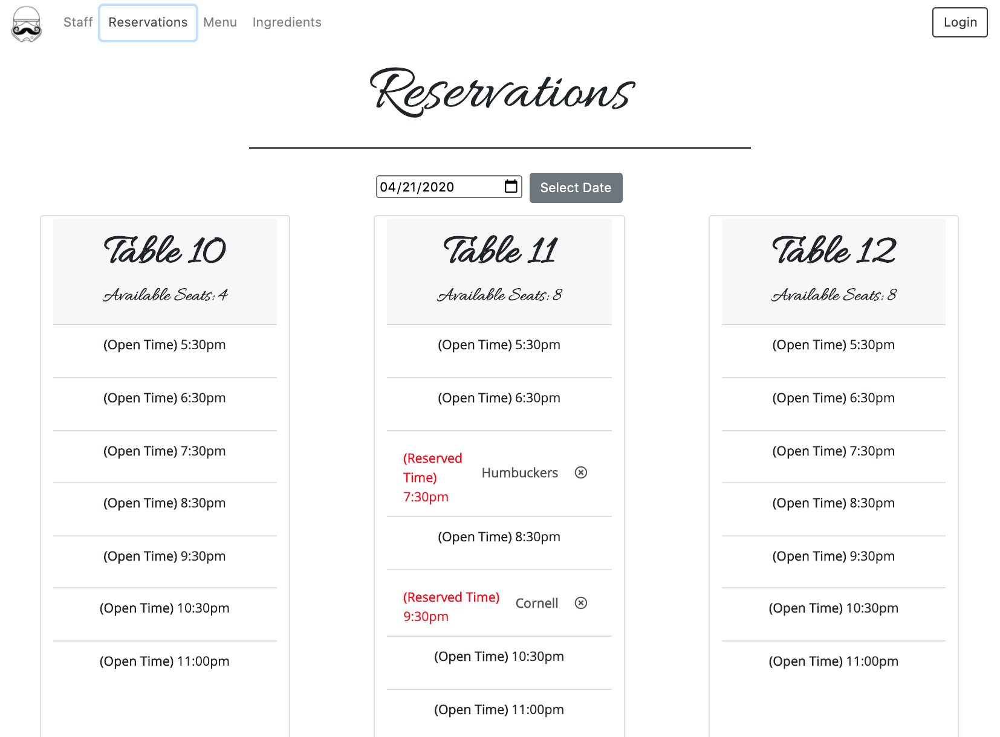
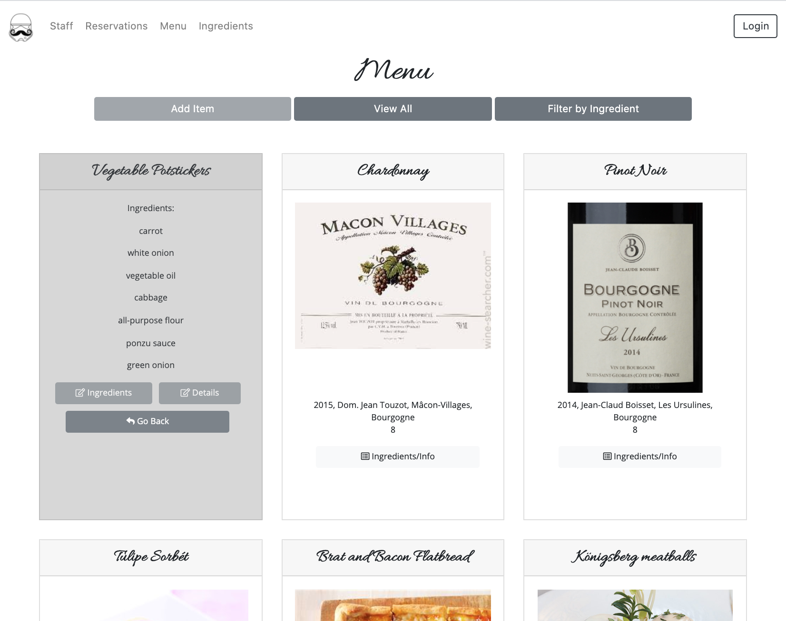
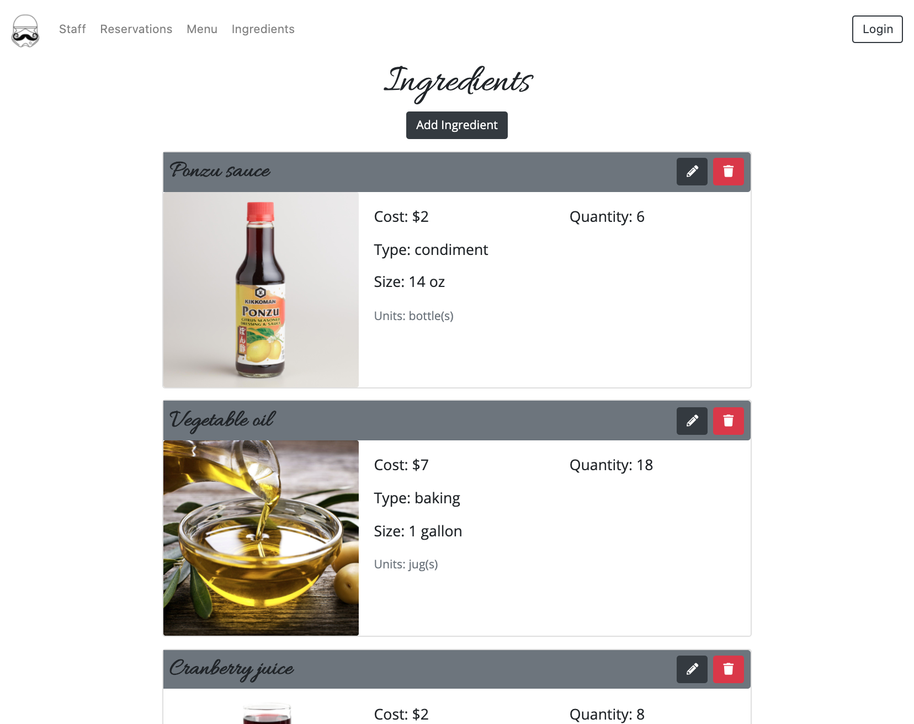

# NSS Group Nutshell Project: "Le Baguette”

### Technologies Used:
HTML5, SCSS/CSS, Vanilla Javascript, Webpack, Firebase

### Description:
NSS group project, deisgned to assist in management and workflow of a fictional, Star-Wars-themed, 27-star Michelin Restaurant.

#### Exercise Requirements
Utilize all of the skills and concepts that you've learned up to this point in the course:

- Functions
- Databases/API (JSON Server Documentation)
- Github
- Objects
- CSS/Flexbox
- Array methods
- Handling user events
- Factory functions
- Implementing CRUD operations
- Modular code with Webpack
- Relational data

### Screenshots:
#### Home/Landing page

#### Staff page with filter opened

#### Reservations

#### Menu with item hover showing details

#### Ingredients/Inventory

### Instructions to Run:
[Click here to view the deployed web app](deployed site)

Or, Run Locally:
1. If you do not have npm http-server installed, follow instuctions [here](https://www.npmjs.com/package/http-server) to install on your device
1. Use GitHub's [Cloning Feature](https://help.github.com/en/github/creating-cloning-and-archiving-repositories/cloning-a-repository) to download a local copy of the files for this project
1. In your command line interface, change directory into the folder that contains your copied files
1. Enter command: `npm install` and wait for completion
1. Enter command: `npm start`
1. The project will automatically render in your browser at url: `http://localhost:8080`
